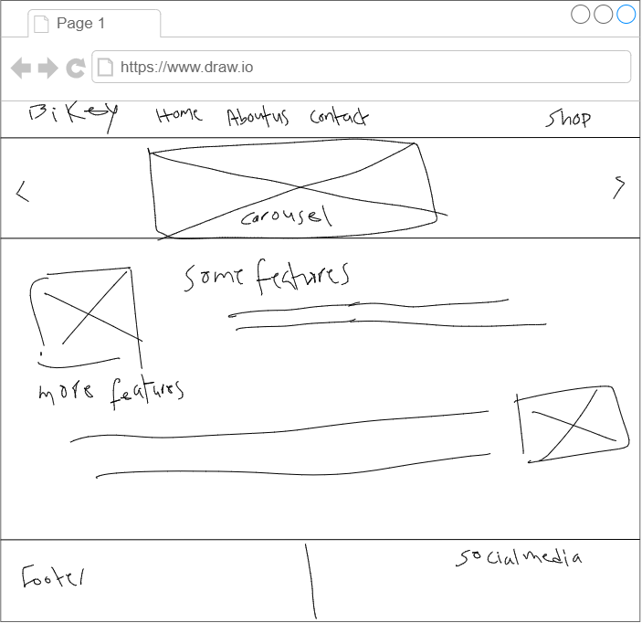
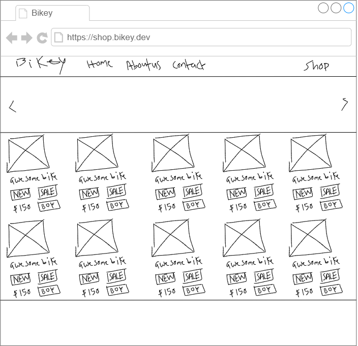
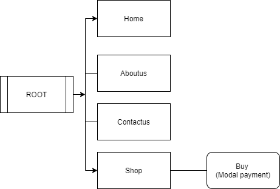

# Capstone Week 2

## Introduction

- This project is a view for a website for an online shop.

- The user navigating throught the website is supposed to find information about the company, also (s)he should be able to buy what is needed once she decides.

- Hence the view should comprise at least the following 
  - A page for shopping
  - Information about the company
  - Kind of a contact form.

## User Interface Design and Prototype

### **Homepage which overviews what the website is having to offer**

### **Shop page which lists the products ready to be sold to the user**

## Navigation Structure

## References

- https://app.diagrams.net